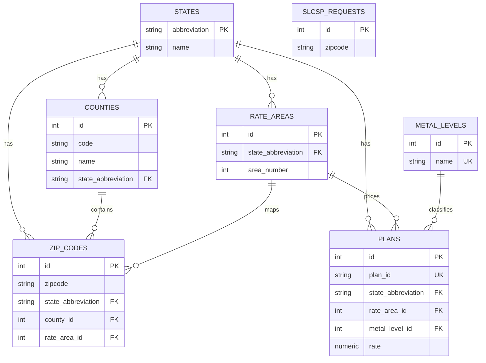

## Relationship Review (Normalized)

This design normalizes plan metal tiers into a dedicated lookup table so `plans` does not
repeat tier strings on every row.

## Key relationship decisions

1. **`state` to `rate area` is one-to-many**.
   - A state can contain multiple rate areas (`rate_areas.area_number` scoped by state).
2. **`plan` to `rate` is not one-to-one**.
   - `rate` remains a scalar attribute on `plans`.
3. **`metal_level` is now a normalized entity**.
   - `metal_levels` stores unique tier names (`Bronze`, `Silver`, etc.).
   - `plans` references `metal_levels` with `metal_level_id`.
4. **`state` to `county code` / `county name` are attributes, not standalone entities**.
5. **Zip-to-rate-area mapping is many-to-many at the natural-key level**, represented by
   `zip_codes` rows that bind zipcode + state + county + rate area context.

## Database Entities and Cardinality

### `states`
- **Primary key:** `abbreviation`
- **One-to-many:** `counties`, `rate_areas`, `plans`, `zip_codes`

### `counties`
- **Primary key:** `id`
- **Foreign key:** `state_abbreviation -> states.abbreviation`
- **One-to-many:** `zip_codes`
- **Constraints:** county `code` and `name` are unique *within a state*

### `rate_areas`
- **Primary key:** `id`
- **Foreign key:** `state_abbreviation -> states.abbreviation`
- **One-to-many:** `plans`, `zip_codes`
- **Constraint:** unique `(state_abbreviation, area_number)`

### `metal_levels`
- **Primary key:** `id`
- **Attribute:** `name` (unique)
- **One-to-many:** `plans`

### `plans`
- **Primary key:** `id`
- **Natural key:** `plan_id` (unique)
- **Foreign keys:**
  - `state_abbreviation -> states.abbreviation`
  - `rate_area_id -> rate_areas.id`
  - `metal_level_id -> metal_levels.id`
- **Attributes:** `rate`

### `zip_codes`
- **Primary key:** `id`
- **Foreign keys:**
  - `state_abbreviation -> states.abbreviation`
  - `county_id -> counties.id`
  - `rate_area_id -> rate_areas.id`
- **Constraint:** unique `(zipcode, state_abbreviation, county_id)`

### `slcsp_requests`
- Stores requested zipcode inputs; no FK enforced to `zip_codes`.

## Relationship Diagram (Lucidchart-friendly Mermaid)

## SQL Diagram Import for Lucidchart

Use `app/models/lucidchart_schema.sql` with Lucidchart's **Database > Import SQL** workflow.

## Notes on Ambiguity Handling

- A zipcode can appear in multiple rows in `zip_codes` (different county/rate-area context).
- That ambiguity is resolved in application logic when computing SLCSP outcomes.
